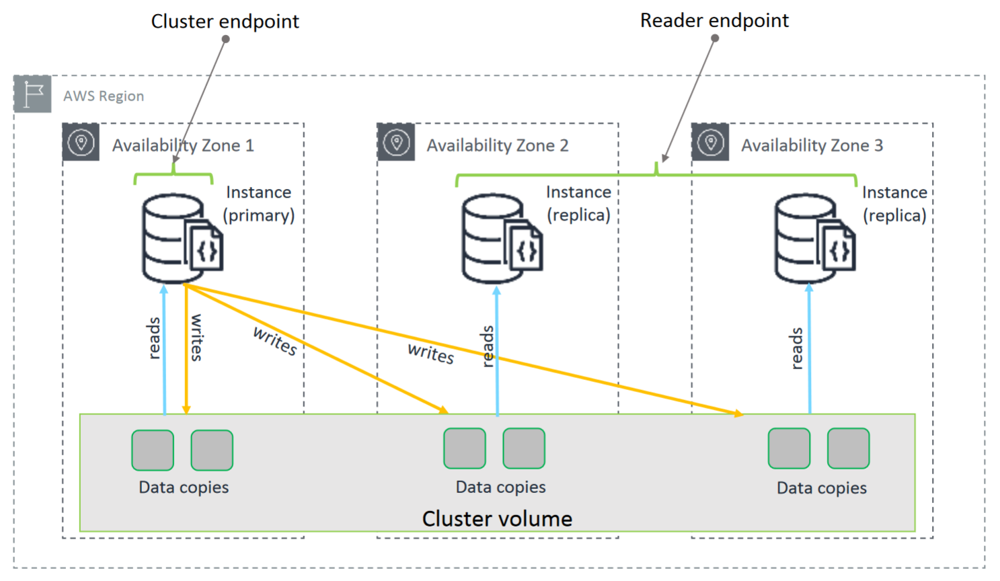

# Amazon DocumentDB
> Mongo database for AWS
- automatically grows the size (10 GB to 64 TiB [¹])
- you can create up to 15 replica instances
- complete scale
- DocumentDB runs in Amazon VPC, so you can isolate your database in your own virtual network
- continuously monitoring the health of the cluster
- if one fail, you have the other instances
- encrypted database with AWS KMS
  
## Clusters
A Cluster consists of 0 to 16 instances. All writes are done through the primary instance. The others including the primary are up to reading

## Instances
A DocumentDB instance is an isolated database environment. An instance can contain multiple databases.  
The instances runs only in the Amazon VPC environment (you can create your own virtual network, choose IP address range, create subnets...)

## Pricing
1. Instance (per hour)
2. I/O (per million requests per month)
3. Backup storage (per GiB per month)
4. Data transfer (per GB)

[¹] B is with the base 1000, meanwhile iB is with base 1024. So GB is 1000³ bytes, while GiB is 1024³ bytes.